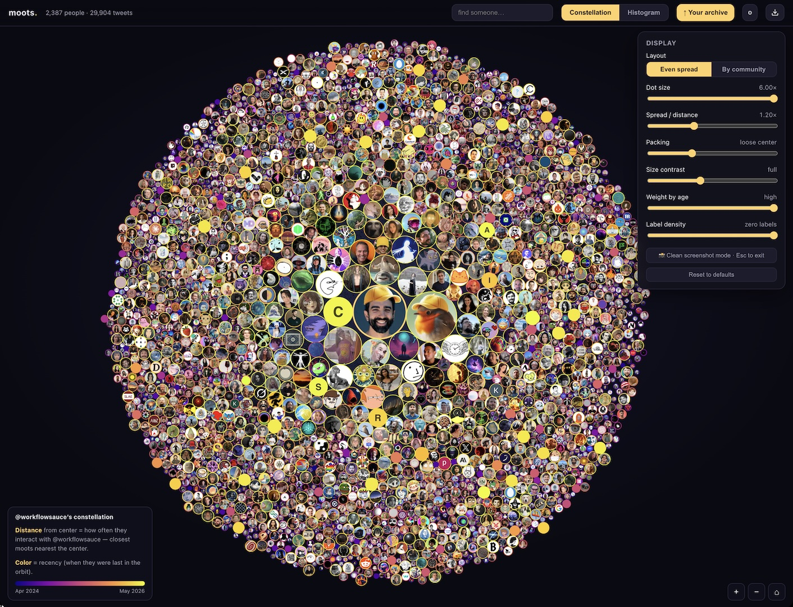

# moots ✦

**Turn your Twitter/X archive into a zoomable constellation of everyone you talk to.**

You're at the center; every person you've mentioned or replied to is a star. The more you
interact, the closer they orbit. Color is recency. Drop in your archive and your whole social
universe appears — fetch real profile pictures, search, multi-select clusters, and share an
image.

🔭 **Live:** [moots.fyi](https://moots.fyi)



---

## Privacy first

Your archive is parsed **entirely in your browser** — your tweets are never uploaded. Only
public handles are sent to fetch profile pictures. If you choose to **publish** your map, only
the aggregated tally (handles, counts, dates) and the preview image are stored — never your
tweet text.

## How it works

- **Parsing & rendering** happen client-side (`web/public/parse.js` + the app in `index.html`).
- A single **Cloudflare Worker** (`web/worker/index.js`) serves the static site *and* a tiny API
  on the same origin:
  - `/pfp?u=<handle>` — resolves a handle to its real `pbs.twimg.com` avatar (edge-cached).
  - `/banner?u=<handle>` — header image URL.
  - `/share` + `/v/:id` — store and serve published maps, with Open-Graph tags for link previews.
- Shares live in **Workers KV**. No database, no server to babysit.

## Deploy your own

[](https://deploy.workers.cloudflare.com/?url=https://github.com/huttj/moots)

One click clones this repo into your Cloudflare account and deploys it (it provisions the KV
namespace for you). Then point your domain at the Worker.

### …or by hand

```bash
npm install
npx wrangler login
npx wrangler kv namespace create SHARES   # paste the printed id into wrangler.toml
npm run deploy
```

### Local development

```bash
npm install
npm run dev          # http://localhost:8787  (Worker + static site + simulated KV)
```

## Project layout

```
web/public/      the app  (index.html, app logic, parse.js, demo data, demo avatars)
web/worker/      the Cloudflare Worker (avatar proxy + share API)
wrangler.toml    one Worker: static assets + API + KV
```

## Get your archive

X → **Settings → Your account → Download an archive of your data**
(<https://x.com/settings/download_your_data>). It takes a day or two. Then drop the `.zip`
(or the `tweets.js` inside it) onto moots. While you're there, consider contributing it to the
[Community Archive](https://www.community-archive.org/).

---

Built with [Claude Code](https://claude.com/claude-code). Profile pictures via x.com / pbs.twimg.com.
Not affiliated with X.
